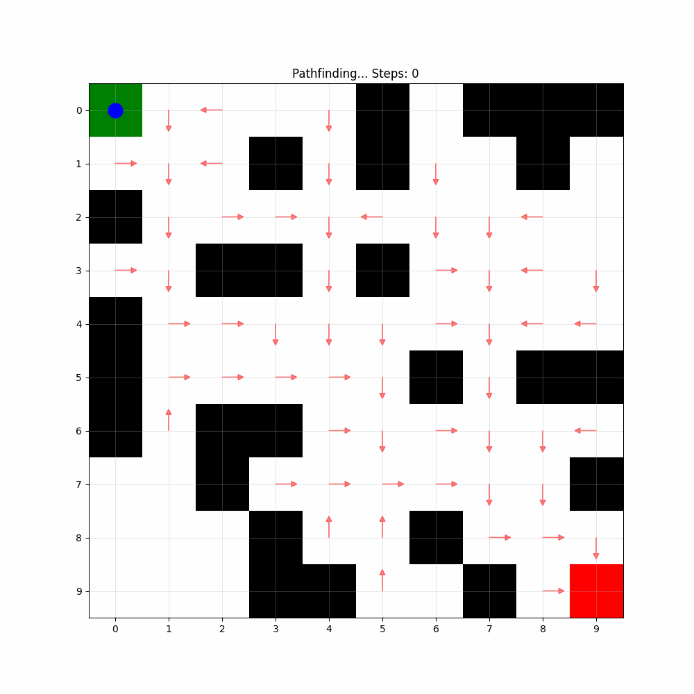

# 基于Q-learning的迷宫寻路 / Maze Pathfinding with Q-Learning

[中文](#中文) | [English](#english)

## Training Process / 训练过程


## Pathfinding Demo / 寻路演示  


---

## 中文

### 项目简介
使用Q-Learning算法学习迷宫导航的强化学习智能体。

### 主要功能
- 支持随机生成和固定布局迷宫
- Q-Learning强化学习算法
- 可自定义学习参数
- 导出训练过程和寻路演示GIF

### 快速开始
1. 安装依赖:
```bash
pip install numpy matplotlib pillow
```

2. 运行训练:
```bash
python train.py
```

### 关键参数
- **学习率 (α)**: 0.1
- **折扣因子 (γ)**: 0.95  
- **探索率 (ε)**: 1.0 → 0.01
- **训练轮数**: 1000
- **最大步数**: 200

### 工作原理
- 迷宫用2D网格表示（0:空地，1:墙壁，2:起点，3:终点）
- 智能体使用ε-贪婪策略探索并更新Q值
- 训练完成后展示学习到的最优路径

> 本笔记仅用于个人学习记录，欢迎参考和改进。  

---

## English

### Overview
A reinforcement learning agent that learns maze navigation using Q-Learning algorithm.

### Features
- Random and fixed maze generation
- Q-Learning algorithm implementation
- Customizable learning parameters
- GIF export for training and pathfinding demos

### Quick Start
1. Install dependencies:
```bash
pip install numpy matplotlib pillow
```

2. Run training:
```bash
python train.py
```

### Key Parameters
- **Learning Rate (α)**: 0.1
- **Discount Factor (γ)**: 0.95
- **Epsilon (ε)**: 1.0 → 0.01
- **Episodes**: 1000
- **Max Steps**: 200

### How It Works
- Maze represented as 2D grid (0:empty, 1:wall, 2:start, 3:goal)
- Agent uses ε-greedy policy to explore and update Q-values
- After training, demonstrates learned optimal path

> *These notes are for personal learning purposes only. Feel free to reference and improve upon them.*